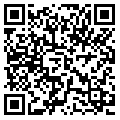

# node-session-client
Implementation of Session protocol in node

Supports
- Session protocol support (Direct messaging)
- Recovery Phrase (13 words)
- Support for communicating with the Loki 10.x network

Working on:
- LNS
- open groups v3
- file server v3
- Avatars
- Attachments
- bugs / error codes
- closed group support
- relying on less 3rd party NPMs (for security reasons)

[Documentation](https://hesiod-project.github.io/node-session-client/)

[Example](sample.js)

Development depends on your support
LT2mP2DrmGD82gFnH16ty8ZtP6f33czpA6XgQdnuTVeT5bNGyy3vnaUezzKq1rEYyq3cvb2GBZ5LjCC6uqDyKnbvFki9aAX

QR Code:

